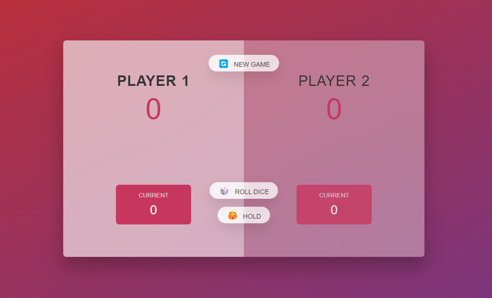

# The-Pick-Game

## Goal of the Project - A two player game where they roll the dice and hold the scores untill it reaches 100 so that the player reaching 100 would be the winner.

### Reference -

### Steps -

1. Player 1 rolls the dice. So this one is now the active player.
2. The rolled number is a two.
3. This number gets added to the current score down here. So the current score for the current round is two.
4. This number gets displayed as the total score.
5. Now, roll the dice again now if I want to, and now I rolled a four and that four got added to the two that it had previously.
6. So now that's six and now I can choose to hold this score.
7. Click this button, this score of the current round will get added to my total score,which right now is zero.
8. The score will be zero now.
9. We now switched to player number two, and I can click roll dice again.
10. We rolled a two and I can hold again. And so now player 2 has two points.
11. The thing here is that whenever we roll a one, we lose all our current score and it's then the next players turn. And so that's why sometimes we need to hold or points.
12. So let's keep rolling the dice.
13. The first player to reach 100 points then wins the game.
